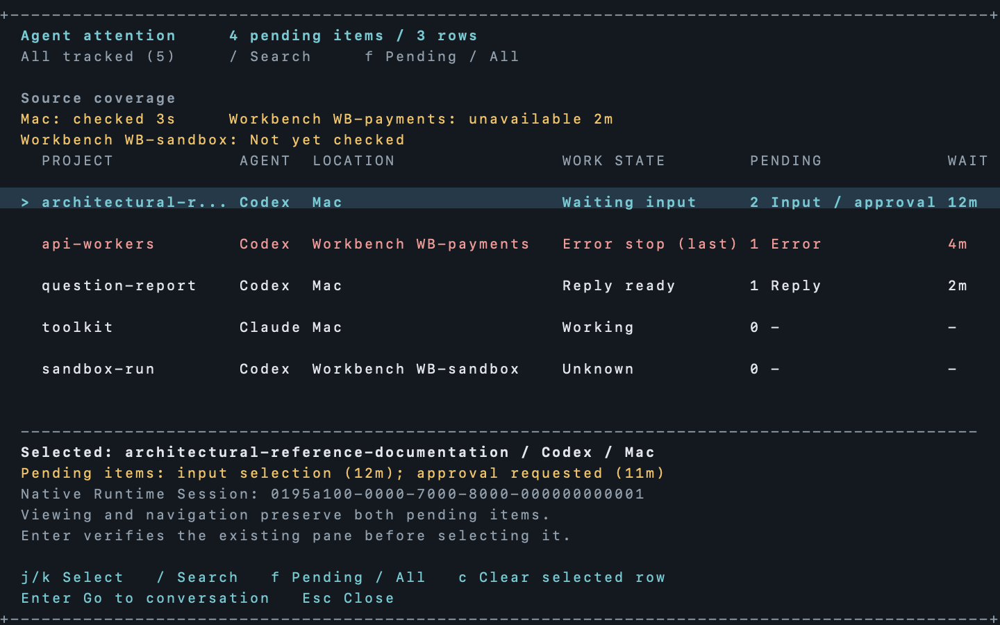
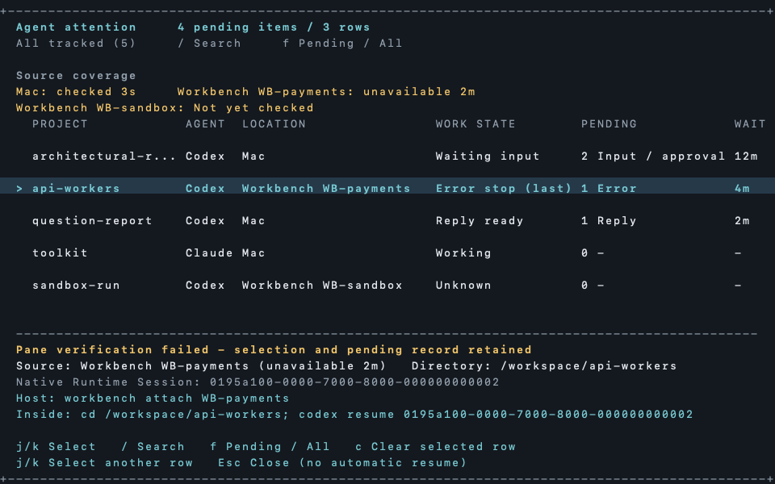
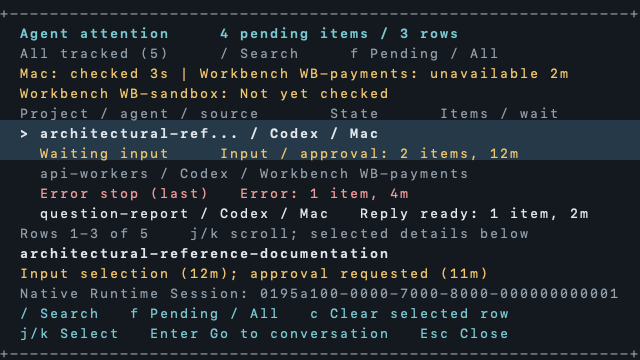
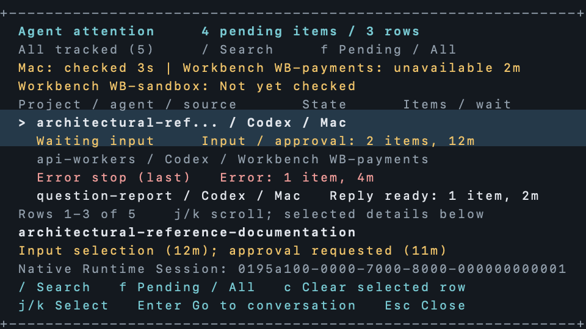
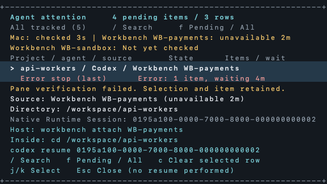
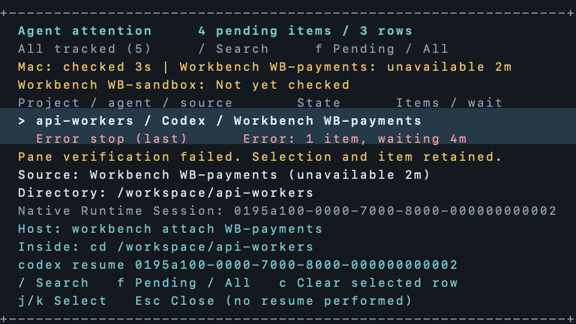

# Spec: Agent attention terminal Reference Screens

- **Work ID:** `work-20260926-codex-attention`
- **Status:** Proposed Reference Screens; awaiting user approval.

## Purpose

Review the exact placement of pending reasons, counts, source coverage, selected native identity and navigation recovery before the dashboard UI is built. The dashboard product behavior is already approved. These images use synthetic data and illustrate a proposed terminal layout; they are not screenshots of a running patched app.

## Review scope

Eight PNGs cover list and recovery states in wide and compact popups at 100% and 150% text scale. The 80% width and 75% height popup yields 96x30 cells inside a 120x40 client, or 64x18 cells inside an 80x24 client. Artwork uses a proposed 10x20-pixel cell pitch at 100% and 15x30 at 150%, with the macOS system monospaced font. These are fixed artwork dimensions, not measured Ghostty dimensions. Production evidence must record actual Ghostty cell/pixel dimensions and compare same-size captures; any font or sizing mismatch remains a review finding.

Selection exposes full project text and separate pending reasons in the lower panel. On compact screens j/k scrolls the five-row list; selected details remain visible. Failed Enter keeps the selection and pending record and shows source, directory and exact native-ID recovery commands. The recovery commands shown here refer to synthetic identities and do not claim those Workbenches exist.

Required controls, counts, location, reason, coverage and focus are visible and unmasked. Privacy masks cover only project-identifying text, native IDs and changing wait values, with exact rectangles in screen-inventory.json. Source observation ages remain unmasked because coverage is part of the review. No deviations are approved. The proposed comparison uses pixelmatch 0.1 color threshold, ignores antialias-only differences, and fails for any remaining unmasked difference. It produces a PNG difference for human review and does not grant Screen Approval.

## Image presentation and approval method

The installed Vizquiry Markdown reader does not render inline PNGs; browser inspection found zero image elements. The actual pictures are displayed in the agent conversation and are available in this review directory. Use the corresponding named sections here to annotate or approve the exact files and digests. This review does not claim that a text label is an image preview.

## Images for approval

### Wide, 100% text, 960x600 pixels


**File:** `screens/ccmux-attention-wide-960x600.png`

**SHA-256:** `470167b8835cc70b8c9771c4468c231c0f9e5fbb1ff2589f272892d0547c2c48`

### Wide, 150% text, 1440x900 pixels



**File:** `screens/ccmux-attention-wide-1440x900.png`

**SHA-256:** `11b4e24020aa321cbda9dadf156d71a42f924964f847b863ca798997637be5ef`

### Wide Recovery, 100% text, 960x600 pixels



**File:** `screens/ccmux-attention-wide-recovery-960x600.png`

**SHA-256:** `473b996ee00530ddf05a7bac21af1abe508d28d3dd912339b6f591c309f13295`

### Wide Recovery, 150% text, 1440x900 pixels


**File:** `screens/ccmux-attention-wide-recovery-1440x900.png`

**SHA-256:** `8e4d8a671286f9d311214adbfbdfdd624117203f9ef2cc37e193dc5116f1da2b`

### Compact, 100% text, 640x360 pixels



**File:** `screens/ccmux-attention-compact-640x360.png`

**SHA-256:** `d994f097013a98ec334fa336c4ab10898f6173a1d1644dc6397c6b44a5bfbe7a`

### Compact, 150% text, 960x540 pixels



**File:** `screens/ccmux-attention-compact-960x540.png`

**SHA-256:** `73cb4b18d1ffc45f00f5da49f7c97bb50f8f51d3da3fe17ca436fd255af8e401`

### Compact Recovery, 100% text, 640x360 pixels



**File:** `screens/ccmux-attention-compact-recovery-640x360.png`

**SHA-256:** `caa441b32497f4460d7d9e882ea856fbfa908b3e96386ffe5cae28a7c20b4d4e`

### Compact Recovery, 150% text, 960x540 pixels



**File:** `screens/ccmux-attention-compact-recovery-960x540.png`

**SHA-256:** `4f2bd544d8be506d6f6aef783f2711e4698a4fd3e0608031ebe62f917afafd37`

## Comparison and runtime evidence

Run from the Reference Screen bundle directory, with the ccmux checkout path supplied as the dependency directory:

```sh
node source/compare-reference-screens.mjs "$CCMUX_EXECUTION_CHECKOUT" screen-inventory.json ccmux-attention-compact 640x360 "$PRODUCTION_PNG" "$DIFFERENCE_PNG"
```

The comparison command validates fixed dimensions and allowed masks. It does not validate keyboard behavior, client targeting, persistent state, source timing, automatic startup or user observations. Those remain the approved real-boundary exercises. Coverage-region deletion must fail the comparison; it cannot be masked or accepted by updating a reference.

## Approval requested

Approve or annotate the proposed layout, eight PNGs, fixed viewport/cell mapping, masks and comparison setup. Approval of this set allows staging the Reference Screens and rendering the dashboard phase briefs. It does not approve those unrendered briefs or any production Screen Approval. If different Ghostty font or pixel dimensions are required, name them in the review so this artwork can be regenerated before approval.
